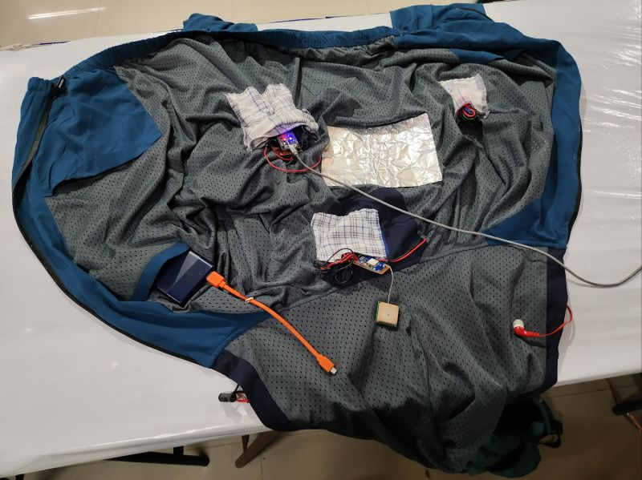
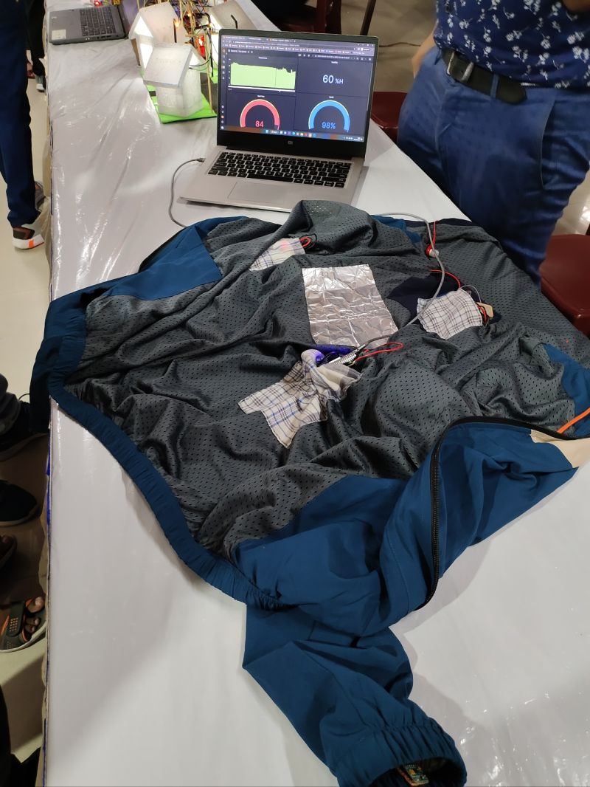

# IoT Smart Jacket

The IoT Smart Jacket is a wearable technology project that integrates various sensors and devices to provide real-time environmental and health data. This README file provides an overview of the project and how to get started.

## Components

The IoT Smart Jacket incorporates the following components:

- **Neo GPS**: Allows for location tracking and movement analysis.
- **DHT11**: Measures temperature and humidity in the surrounding environment.
- **ESP32**: Serves as the central processing unit for data collection and communication.
- **Pulse Oximeter Sensor**: Monitors oxygen saturation levels and pulse rate for health tracking.
- **ESP Touch Sensor**: Enables easy configuration and connectivity.

## Features

- **Real-time Location Tracking**: Utilizes the Neo GPS module to provide accurate location information.
- **Environmental Monitoring**: The DHT11 sensor records temperature and humidity data for the wearer's comfort.
- **Health Tracking**: The Pulse Oximeter sensor measures SpO2 levels and pulse rate, enabling health monitoring.
- **Wireless Connectivity**: The ESP32 connects to local Wi-Fi networks or other IoT devices using the ESP Touch sensor.
- **Data Storage**: Collects and stores data for later analysis or transmission to a central server.
- **User-Friendly Interface**: Provides an intuitive way for users to interact with the jacket.

## Getting Started

To get started with the IoT Smart Jacket project, follow these steps:

1. **Gather Components**: Ensure you have all the required components, including the Neo GPS, DHT11, ESP32, Pulse Oximeter Sensor, and ESP Touch Sensor.

2. **Assembly**: Carefully integrate the sensors into the jacket, ensuring they are securely and comfortably placed.

3. **Coding**: Write code to collect data from the sensors using appropriate libraries. Create logic for data processing and transmission.

4. **Power Management**: Implement efficient power management to extend battery life.

5. **User Interface**: If applicable, design a user interface to allow users to interact with the jacket.

6. **Security**: Consider data security and privacy, especially if handling health-related data.

7. **Testing**: Thoroughly test the jacket to ensure all sensors and features work correctly.

8. **Documentation**: Create comprehensive documentation for the project, including code comments and user instructions.

 ## IoT Data Analysis with CONSENTIUM CLOUD

We leverage [CONSENTIUM CLOUD](https://www.consentiuminc.online/) as our IoT service for real-time data analysis and management. CONSENTIUM CLOUD provides the following benefits to our IoT Smart Jacket project:

- **Real-Time Data Insights**: CONSENTIUM CLOUD allows us to collect, store, and analyze data from our jacket's sensors in real-time.

- **Scalability**: It offers scalable infrastructure, enabling us to handle a large volume of data efficiently.

- **Data Security**: CONSENTIUM CLOUD prioritizes data security, ensuring that sensitive information, such as health data, remains confidential.

- **Custom Dashboards**: We use CONSENTIUM CLOUD's dashboard features to create customized displays for monitoring and visualizing the data collected by our Smart Jacket.

By integrating CONSENTIUM CLOUD into our project, we can provide users with valuable insights and a seamless IoT experience.

For more information on how to connect our IoT Smart Jacket with CONSENTIUM CLOUD, refer to the [CONSENTIUM CLOUD Documentation]((https://github.com/ConsentiumInc/ConsentiumThingsDalton))(https://github.com/ConsentiumInc/ConsentiumThingsDalton)).

**Note:** You will need to obtain API keys or credentials from CONSENTIUM CLOUD to establish the connection. Make sure to keep these credentials secure and follow best practices for IoT data security.

## Contributing

If you'd like to contribute to the IoT Smart Jacket project, please follow our [contribution guidelines](CONTRIBUTING.md).

## License

This project is licensed under the [MIT License](LICENSE.md).

## Acknowledgments

We would like to acknowledge the open-source community for their valuable contributions to the libraries and tools used in this project.

## Contact

For inquiries or support, please contact [MISTER NEGATIVE](mailto:misternegative21@gmail.com).

--- 
